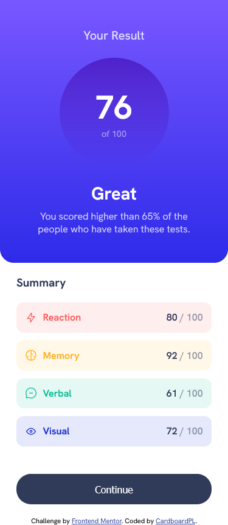
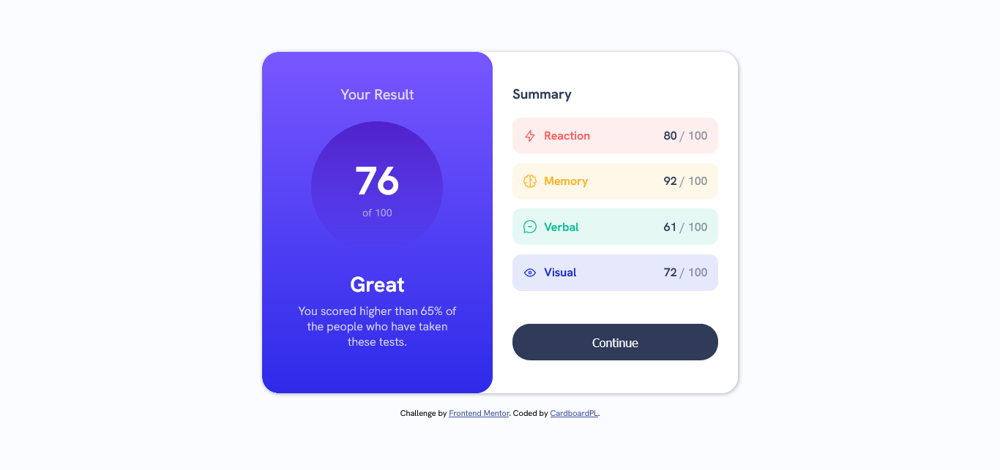

# Frontend Mentor - Results summary component solution

This is a solution to the [Results summary component challenge on Frontend Mentor](https://www.frontendmentor.io/challenges/results-summary-component-CE_K6s0maV). Frontend Mentor challenges help you improve your coding skills by building realistic projects. 

## Table of contents

- [Overview](#overview)
  - [The challenge](#the-challenge)
  - [Screenshot](#screenshot)
  - [Links](#links)
- [My process](#my-process)
  - [Built with](#built-with)
  - [What I learned](#what-i-learned)
  - [Continued development](#continued-development)
  - [Useful resources](#useful-resources)
- [Author](#author)

## Overview

### The challenge

Users should be able to:

- View the optimal layout for the interface depending on their device's screen size
- See hover and focus states for all interactive elements on the page
- **Bonus**: Use the local JSON data to dynamically populate the content

### Screenshot

### Links

- Solution URL: [GitHub Repo](https://github.com/CardboardPL/Frontend-Mentor-Results-summary-component)
- Live Site URL: [GitHub Pages](https://cardboardpl.github.io/Frontend-Mentor-Results-summary-component/)

## My process

### Built with

- Semantic HTML5 markup
- CSS
- Flexbox
- Javascript
- Desktop-first workflow

### What I learned

I learned how to use the fetch function to fetch the data needed to dynamically populate the summary list items.
### Continued development

I plan to use this as an inspiration for my future projects

### Useful resources

- [YouTube Video on how to use the fetch function](https://www.youtube.com/watch?v=zUcc4vW-jsI) - This helped me to understand how to use the fetch function.

## Author

- Frontend Mentor - [@CardboardPL](https://www.frontendmentor.io/profile/CardboardPL)
- Twitter - [@SirPLWasTaken](https://www.twitter.com/SirPLWasTaken)
